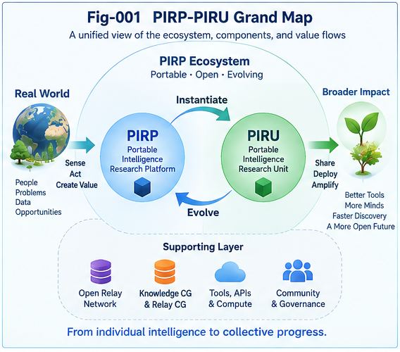

# FIGURE INDEX

## Portable Intelligence Runtime Pieces and Units — PIRP / PIRU

### Canonical Visual Map and Figure Placement Guide

---

## Overview

This repository contains **seven canonical figures** covering the conceptual progression from runtime intelligence to Portable Intelligence, Open PIRPs, Relay, Relay Localization, Collective Learning, and Computational Growth.

The visual sequence is:

```text
Fig-001
PIRP/PIRU Grand Map
      |
      v
Fig-002
PIRP <-> PIRU
      |
      v
Fig-003
Lifecycle and Growth
      |
      v
Fig-004
Portable Intelligence Transfer
      |
      v
Fig-005
Open PIRP and Research Relay
      |
      v
Fig-006
Knowledge CG + Relay CG
      |
      v
Fig-007
Relay Localization + Dispatch
````

Together, the seven figures form the visual backbone of the repository.

---

# Figure Summary

| Figure  | Title                                         | Primary Topic                   | Primary Article |
| ------- | --------------------------------------------- | ------------------------------- | --------------- |
| Fig-001 | PIRP/PIRU Grand Map                           | Complete Framework              | 001 / 008       |
| Fig-002 | From PIRP to PIRU and Back                    | Emergence and Unitization       | 002             |
| Fig-003 | PIRP Lifecycle and Computational Growth       | Runtime Lifecycle               | 003             |
| Fig-004 | Portable Intelligence and Collective Learning | Publish and Transfer            | 004             |
| Fig-005 | Open PIRP Relay and Research Relay            | Unresolved Intelligence         | 005             |
| Fig-006 | Knowledge CG and Relay CG                     | Collective Intelligence History | 006             |
| Fig-007 | Relay Localization and PIRP Dispatch Plane    | Growth Dispatch                 | 007             |

---

# Fig-001 — PIRP/PIRU Grand Map

## File

[`figures/Fig-001-PIRP-PIRU-Grand-Map.png`](figures/Fig-001-PIRP-PIRU-Grand-Map.png)

## Role

**Canonical Grand Map / Repository-Level Overview**

Fig-001 presents the complete PIRP/PIRU framework in one visual structure.

It connects:

```text
Runtime Reality
      |
      v
Emergent Intelligence
      |
      v
PIRP
      |
      +----------> Formalization -> PIRU
      |
      +----------> Publish
      |
      +----------> Execution / Continuation
                              |
                              v
                       Structural Delta
                              |
                              v
                         New PIRP(s)
```

It then extends the runtime object into the larger intelligence ecology:

```text
PIRP / PIRU
     |
     v
Publish
     |
     v
Intelligence Commons
     |
     v
Search / Localization
     |
     v
Relay
     |
     v
Structural Growth
     |
     v
Collective Learning
```

## Canonical Meaning

The figure expresses the repository's broad transition:

> **Runtime Intelligence -> Portable Intelligence -> Relayable Intelligence -> Collective Learning -> Computational Growth Intelligence**

It should be treated as the main visual summary of the DOI.

## Primary Article

### PIRP-PIRU-001

[`docs/PIRP-PIRU-001-From-Per-Node-Intelligence-to-Portable-Runtime-Intelligence.md`](docs/PIRP-PIRU-001-From-Per-Node-Intelligence-to-Portable-Runtime-Intelligence.md)

### Recommended Placement

Insert after the early section that introduces the three outputs of Per-Node Intelligence:

```text
Value / State
Structural Trigger
Portable Runtime Intelligence
```

and after PIRP/PIRU have first been defined.

Recommended caption:

> **Fig-001 — PIRP/PIRU Grand Map.** Portable Runtime Intelligence emerges as PIRP, may be formalized into PIRU, transferred across intelligence boundaries, localized and relayed, and ultimately participates in Collective Learning and Computational Growth.

---

## Secondary Article

### PIRP-PIRU-008

[`docs/PIRP-PIRU-008-The-PIRP-PIRU-Ecology-and-an-Evolutionary-Roadmap.md`](docs/PIRP-PIRU-008-The-PIRP-PIRU-Ecology-and-an-Evolutionary-Roadmap.md)

### Recommended Placement

Insert near the beginning of the article, immediately after introducing the integrated PIRP/PIRU Ecology.

Here the figure functions as the **system-level map** before the Level 0–7 evolutionary roadmap is explained.

---

## Repository-Level Placement

Fig-001 is also recommended for:

* `README.md`
* `START-HERE.md`
* ResearchGate overview
* DOI overview
* presentation opening
* poster / project introduction

---

# Fig-002 — From PIRP to PIRU and Back

## File

[`figures/Fig-002-From-PIRP-to-PIRU-and-Back.png`](figures/Fig-002-From-PIRP-to-PIRU-and-Back.png)

## Role

**Canonical PIRP/PIRU Duality Diagram**

Fig-002 illustrates the relationship between emerging intelligence and formalized intelligence.

The core loop is:

```text
Runtime Reality
      |
      v
Emergent Intelligence
      |
      v
PIRP
      |
      v
Recognition
Boundary Discovery
Validation
Typing
Interface Extraction
      |
      v
PIRU
      |
      v
Execution
Localization
Composition
      |
      v
Runtime Interaction
      |
      v
Structural Delta
      |
      v
New PIRP
```

## Canonical Meaning

The figure makes two points explicit.

First:

> **PIRP and PIRU are complementary rather than competing abstractions.**

Second:

> **Formalization is not the end of intelligence growth. Runtime interaction can reopen formal structure and produce new PIRPs.**

The resulting cycle is:

```text
Emergence
   |
   v
PIRP
   |
   v
Unitization
   |
   v
PIRU
   |
   v
Runtime
   |
   v
Growth
   |
   +-------> Emergence
```

## Primary Article

### PIRP-PIRU-002

[`docs/PIRP-PIRU-002-Pre-Categorical-Intelligence-and-the-PIRP-PIRU-Duality.md`](docs/PIRP-PIRU-002-Pre-Categorical-Intelligence-and-the-PIRP-PIRU-Duality.md)

## Recommended Placement

Insert after the article has introduced:

* Pre-Categorical Intelligence,
* PIRP as discovery-oriented Piece,
* PIRU as formalized Unit,
* and the PIRP/PIRU duality.

The best location is immediately before or after the section describing:

> **Emergence <-> Unitization**

Recommended caption:

> **Fig-002 — From PIRP to PIRU and Back.** Emerging runtime intelligence can be preserved as PIRP, progressively formalized into PIRU, and reopened through runtime interaction and Structural Growth.

---

## Secondary Use

Fig-002 may also be referenced from:

### PIRP-PIRU-003

when discussing lifecycle transitions and PIRU reopening.

---

# Fig-003 — PIRP Lifecycle and Computational Growth

## File

[`figures/Fig-003-PIRP-Lifecycle-and-Computational-Growth.png`](figures/Fig-003-PIRP-Lifecycle-and-Computational-Growth.png)

## Role

**Canonical Runtime Lifecycle Diagram**

Fig-003 focuses on what happens after a PIRP has emerged.

The lifecycle includes:

```text
Birth
  |
  v
Capture
  |
  v
Localization
  |
  v
Execution / Continuation
  |
  v
Observation
  |
  v
Validation
  |
  v
Specialization
  |
  v
Branching / Composition
  |
  v
Unitization
  |
  v
Reuse
  |
  v
Growth
```

Possible outcomes include:

```text
New PIRP
New PIRU
Composite PIRP
Specialized PIRP
Retired PIRP
Reopened PIRU
```

## Canonical Meaning

The figure distinguishes **lifecycle** from simple object persistence.

A PIRP does not merely exist.

It can:

```text
act
be observed
be challenged
branch
compose
formalize
reopen
grow
retire
```

Computational Growth therefore occurs through meaningful structural change rather than object accumulation alone.

## Primary Article

### PIRP-PIRU-003

[`docs/PIRP-PIRU-003-PIRP-Anatomy-Lifecycle-and-Computational-Growth.md`](docs/PIRP-PIRU-003-PIRP-Anatomy-Lifecycle-and-Computational-Growth.md)

## Recommended Placement

Insert after the PIRP Anatomy section and before the detailed lifecycle discussion.

The article should first establish what a PIRP contains, then use Fig-003 to transition from:

```text
What is inside a PIRP?
```

to:

```text
What happens to a PIRP over time?
```

Recommended caption:

> **Fig-003 — PIRP Lifecycle and Computational Growth.** PIRPs move through localization, execution, observation, validation, specialization, branching, composition, unitization, reuse, and growth, producing new Structural Deltas and intelligence structures.

---

# Fig-004 — Portable Intelligence and Collective Learning

## File

[`figures/Fig-004-Portable-Intelligence-and-Collective-Learning.png`](figures/Fig-004-Portable-Intelligence-and-Collective-Learning.png)

## Role

**Canonical Portable Intelligence Transfer Diagram**

Fig-004 expands portability beyond software execution.

The central path is:

```text
Intelligence-A
      |
      v
Externalization
      |
      v
PIRP / PIRU
      |
      v
Publish
      |
      v
Shared Intelligence Space
      |
      v
Discovery
      |
      v
Localization
      |
      v
Intelligence-B
      |
      v
Known-Knowledge Update
      |
      v
Continuation / Growth
```

## Canonical Meaning

The figure represents four levels of portability:

```text
Computational Portability
          |
          v
Contextual Portability
          |
          v
Agent Portability
          |
          v
Civilizational Portability
```

Its central proposition is:

> **A PIRP is not merely portable across runtimes; it may be portable across intelligences.**

It also establishes publishing as a runtime operation:

> **Publish = inject a portable intelligence structure into a larger intelligence runtime.**

## Primary Article

### PIRP-PIRU-004

[`docs/PIRP-PIRU-004-Publishing-as-Portable-Intelligence-Transfer.md`](docs/PIRP-PIRU-004-Publishing-as-Portable-Intelligence-Transfer.md)

## Recommended Placement

Insert after the article introduces the stronger Portability Test:

> Can another intelligence receive this piece, localize it into its own Known-Knowledge, continue its computation, and grow from where the previous intelligence stopped?

This is the natural transition from portability theory to Collective Learning.

Recommended caption:

> **Fig-004 — Portable Intelligence and Collective Learning.** Portable Intelligence can cross runtime, context, agent, organizational, and generational boundaries through publication, localization, Known-Knowledge integration, and continued computation.

---

## Secondary Use

Fig-004 may also be referenced in:

### PIRP-PIRU-008

when introducing the Intelligence Commons and distributed Collective Learning.

---

# Fig-005 — Open PIRP Relay and Research Relay

## File

[`figures/Fig-005-Open-PIRP-Relay-and-Research-Relay.png`](figures/Fig-005-Open-PIRP-Relay-and-Research-Relay.png)

## Role

**Canonical Unresolved-Intelligence and Research-Relay Diagram**

Fig-005 captures one of the major extensions of PIRP:

> **Problems themselves can become Portable Intelligence.**

The central path is:

```text
Known
  |
  v
Known-Unknown Boundary
  |
  v
Unknown
  |
  v
Structural Gap
  |
  v
Open PIRP
  |
  v
Publish
  |
  v
Relay
  |
  v
Another Intelligence
  |
  v
Investigation
  |
  v
Structural Delta
  |
  +------------------+
  |                  |
  v                  v
Updated Open PIRP   Resolution
```

## Canonical Meaning

An Open PIRP may preserve:

```text
Problem
Context
Known
Unknown
Structural Gap
Evidence
Counter-Evidence
Constraints
Failed Attempts
Required Capabilities
Required Tools
Validation Conditions
Open Interfaces
```

The key principle is:

> **A well-formed problem is executable intelligence whose next computation has not yet been completed.**

The figure also introduces the possibility of distributed Research Relay.

## Primary Article

### PIRP-PIRU-005

[`docs/PIRP-PIRU-005-Open-PIRPs-and-Unresolved-Intelligence.md`](docs/PIRP-PIRU-005-Open-PIRPs-and-Unresolved-Intelligence.md)

## Recommended Placement

Insert after the Open PIRP anatomy has been defined and immediately before the detailed discussion of Relay or Research Relay.

This gives the reader the complete transition:

```text
Problem
   |
   v
Structured Frontier
   |
   v
Portable Open Intelligence
   |
   v
Relay
```

Recommended caption:

> **Fig-005 — Open PIRP Relay and Research Relay.** A structured Known-Unknown Boundary can become an Open PIRP, be published and relayed to another intelligence, and produce a new Structural Delta, partial resolution, or a refined frontier.

---

## Secondary Use

Fig-005 may also be referenced from:

### PIRP-PIRU-007

when explaining why Relay Localization often begins from an Open PIRP.

---

# Fig-006 — Knowledge CG and Relay CG

## File

[`figures/Fig-006-Knowledge-CG-and-Relay-CG.png`](figures/Fig-006-Knowledge-CG-and-Relay-CG.png)

## Role

**Canonical Dual-CallingGraph Diagram**

Fig-006 distinguishes two different forms of structural memory.

### Knowledge CallingGraph

```text
PIRP-A
  |
  +---- extends ------> PIRP-B
  |
  +---- contradicts --> PIRP-C
  |
  +---- validates ----> PIRP-D
```

It answers:

> **What intelligence relates to what intelligence?**

### Relay CallingGraph

```text
PIRP-A
   |
   v
Agent-X
   |
   v
PIRP-B
   |
   v
Agent-Y
   |
   v
PIRP-C
```

with Relay Context such as:

```text
Context
Perspective
Capability
Tool
Transformation
Structural Delta
Outcome
```

It answers:

> **How did intelligence actually move, who or what received it, under what context, and what growth followed?**

## Canonical Meaning

The two graphs preserve different information.

```text
Knowledge CG
=
Structural relationships among intelligence


Relay CG
=
Actual history of intelligence continuation
```

Together:

```text
Knowledge CG
     +
Relay CG
     +
Context
     +
Capability Evidence
     +
Outcome
     |
     v
Collective Intelligence CallingGraph
```

The figure establishes a key proposition:

> **The path of intelligence growth is itself intelligence.**

## Primary Article

### PIRP-PIRU-006

[`docs/PIRP-PIRU-006-Relay-Context-and-the-Collective-Intelligence-CallingGraph.md`](docs/PIRP-PIRU-006-Relay-Context-and-the-Collective-Intelligence-CallingGraph.md)

## Recommended Placement

Insert immediately after both Knowledge CallingGraph and Relay CallingGraph have been individually defined.

The figure should appear before the article moves into:

* Structural Comparative Advantage,
* Relay History,
* Capability learning,
* future dispatch.

Recommended caption:

> **Fig-006 — Knowledge CG and Relay CG.** The Knowledge CallingGraph preserves structural relations among intelligence objects, while the Relay CallingGraph preserves how intelligence actually moved, under which context and perspective, and what Structural Growth followed.

---

# Fig-007 — Relay Localization and PIRP Dispatch Plane

## File

[`figures/Fig-007-Relay-Localization-and-PIRP-Dispatch-Plane.png`](figures/Fig-007-Relay-Localization-and-PIRP-Dispatch-Plane.png)

## Role

**Canonical Relay Localization / Dispatch Architecture**

Fig-007 presents the operational bridge from Portable Intelligence to Computational Growth Dispatch.

The main flow is:

```text
                    PIRP
                     |
                     v
          Structural Representation
                     |
                     v
          Structural / Metric Search
                     |
          +----------+----------+
          |          |          |
          v          v          v
      Knowledge  Capability    Tools
          |          |          |
          +----------+----------+
                     |
                     v
              Candidate Relay
                     |
                     v
           Counter-Evidence Search
                     |
                     v
               Policy / PDS
                     |
                     v
                  Dispatch
                     |
                     v
           Receiving Intelligence
                     |
                     v
              Structural Delta
                     |
                     v
                Relay Context
                     |
                     v
           Collective Learning
                     |
                     v
          Better Future Dispatch
```

## Canonical Meaning

Fig-007 distinguishes two forms of Localization.

### Structural Localization

> **Where is relevant intelligence?**

### Relay Localization

> **Who or what should continue this intelligence?**

The broader problem becomes:

> **Computational Growth Localization**

Conceptually:

```text
PIRP
+
Knowledge
+
Agent
+
Tool
+
Context
+
Policy
      |
      v
Productive Structural Growth
```

The figure also captures the principle:

> **Social Proximity is not Intelligence Proximity.**

The most useful relay may be an intelligence that is socially or organizationally distant but structurally near.

## Primary Article

### PIRP-PIRU-007

[`docs/PIRP-PIRU-007-Relay-Localization-and-Computational-Growth-Dispatch.md`](docs/PIRP-PIRU-007-Relay-Localization-and-Computational-Growth-Dispatch.md)

## Recommended Placement

Insert after the article has defined:

* Structural Localization,
* Relay Localization,
* Knowledge Distance,
* Capability Distance,
* Relay Distance.

Place it immediately before or at the beginning of the **PIRP Dispatch Plane** section.

Recommended caption:

> **Fig-007 — Relay Localization and PIRP Dispatch Plane.** A PIRP is structurally matched against knowledge, capabilities, tools, relay history, counter-evidence, and policy to identify a productive continuation target; the resulting Structural Delta and Relay Context feed future Collective Learning and dispatch.

---

## Secondary Article

### PIRP-PIRU-008

[`docs/PIRP-PIRU-008-The-PIRP-PIRU-Ecology-and-an-Evolutionary-Roadmap.md`](docs/PIRP-PIRU-008-The-PIRP-PIRU-Ecology-and-an-Evolutionary-Roadmap.md)

### Recommended Placement

Reference Fig-007 in the Level 3–4 discussion:

```text
Level 3 — AI Relay Localization
Level 4 — Relay Graph
```

It provides the operational architecture connecting those two levels.

---

# Article-to-Figure Placement Map

## PIRP-PIRU-001

**Primary Figure:** Fig-001

Recommended placement:

```text
Introduction
      |
      v
Three Per-Node Outputs
      |
      v
Define PIRP / PIRU
      |
      v
[ INSERT FIG-001 ]
      |
      v
Detailed Framework
```

---

## PIRP-PIRU-002

**Primary Figure:** Fig-002

Recommended placement:

```text
Pre-Categorical Intelligence
      |
      v
PIRP / PIRU Duality
      |
      v
[ INSERT FIG-002 ]
      |
      v
Emergence <-> Unitization
```

---

## PIRP-PIRU-003

**Primary Figure:** Fig-003

Recommended placement:

```text
PIRP Anatomy
      |
      v
Minimum Properties
      |
      v
[ INSERT FIG-003 ]
      |
      v
Lifecycle
      |
      v
Computational Growth
```

---

## PIRP-PIRU-004

**Primary Figure:** Fig-004

Recommended placement:

```text
Portable Intelligence
      |
      v
Portability Test
      |
      v
[ INSERT FIG-004 ]
      |
      v
Publishing
      |
      v
Collective Learning
```

---

## PIRP-PIRU-005

**Primary Figure:** Fig-005

Recommended placement:

```text
Open PIRP Definition
      |
      v
Open PIRP Anatomy
      |
      v
[ INSERT FIG-005 ]
      |
      v
Research Relay
      |
      v
Open-PIRP Ecology
```

---

## PIRP-PIRU-006

**Primary Figure:** Fig-006

Recommended placement:

```text
Relay Context
      |
      v
Knowledge CallingGraph
      |
      v
Relay CallingGraph
      |
      v
[ INSERT FIG-006 ]
      |
      v
Collective Intelligence CallingGraph
      |
      v
Structural Comparative Advantage
```

---

## PIRP-PIRU-007

**Primary Figure:** Fig-007

Recommended placement:

```text
Structural Localization
      |
      v
Relay Localization
      |
      v
Three Distances
      |
      v
[ INSERT FIG-007 ]
      |
      v
PIRP Dispatch Plane
      |
      v
Computational Growth Localization
```

---

## PIRP-PIRU-008

**Primary Figures:** Fig-001 and Fig-007

Recommended placement:

```text
Introduction
      |
      v
PIRP/PIRU Ecology
      |
      v
[ REFERENCE / INSERT FIG-001 ]
      |
      v
Existing Substrate
      |
      v
Evolution Levels 0–2
      |
      v
Levels 3–4
      |
      v
[ REFERENCE FIG-007 ]
      |
      v
Levels 5–7
      |
      v
Computational Growth Intelligence
```

If avoiding repeated images inside the repository, Fig-001 and Fig-007 can simply be linked rather than embedded again in Article 008.

---

# Canonical Figure Insertion Syntax

Use the following GitHub Markdown format:

```text


**Fig-001 — PIRP/PIRU Grand Map.** Portable Runtime Intelligence emerges as PIRP, may be formalized into PIRU, transferred across intelligence boundaries, localized and relayed, and ultimately participates in Collective Learning and Computational Growth.
```

For files in the repository root, such as `README.md`, use:

```text

```

For files under `docs/`, use:

```text

```

---

# Canonical Figure Captions

## Fig-001

> **Fig-001 — PIRP/PIRU Grand Map.** Portable Runtime Intelligence emerges as PIRP, may be formalized into PIRU, transferred across intelligence boundaries, localized and relayed, and ultimately participates in Collective Learning and Computational Growth.

## Fig-002

> **Fig-002 — From PIRP to PIRU and Back.** Emerging runtime intelligence can be preserved as PIRP, progressively formalized into PIRU, and reopened through runtime interaction and Structural Growth.

## Fig-003

> **Fig-003 — PIRP Lifecycle and Computational Growth.** PIRPs move through localization, execution, observation, validation, specialization, branching, composition, unitization, reuse, and growth, producing new Structural Deltas and intelligence structures.

## Fig-004

> **Fig-004 — Portable Intelligence and Collective Learning.** Portable Intelligence can cross runtime, context, agent, organizational, and generational boundaries through publication, localization, Known-Knowledge integration, and continued computation.

## Fig-005

> **Fig-005 — Open PIRP Relay and Research Relay.** A structured Known-Unknown Boundary can become an Open PIRP, be published and relayed to another intelligence, and produce a new Structural Delta, partial resolution, or a refined frontier.

## Fig-006

> **Fig-006 — Knowledge CG and Relay CG.** The Knowledge CallingGraph preserves structural relations among intelligence objects, while the Relay CallingGraph preserves how intelligence actually moved, under which context and perspective, and what Structural Growth followed.

## Fig-007

> **Fig-007 — Relay Localization and PIRP Dispatch Plane.** A PIRP is structurally matched against knowledge, capabilities, tools, relay history, counter-evidence, and policy to identify a productive continuation target; the resulting Structural Delta and Relay Context feed future Collective Learning and dispatch.

---

# Visual Reading Path

For readers who want to understand the framework primarily through figures:

```text
Fig-001
"What is the whole system?"
      |
      v
Fig-002
"What are PIRP and PIRU?"
      |
      v
Fig-003
"How does a PIRP live and grow?"
      |
      v
Fig-004
"How does intelligence become portable?"
      |
      v
Fig-005
"Can unresolved intelligence be portable?"
      |
      v
Fig-006
"How do we remember intelligence relations and relay history?"
      |
      v
Fig-007
"How do we find where intelligence should grow next?"
```

This sequence mirrors the conceptual progression of the eight core articles.

---

# Figure-to-Concept Map

| Concept                              | Figure                      |
| ------------------------------------ | --------------------------- |
| Portable Runtime Intelligence        | Fig-001                     |
| PIRP                                 | Fig-001 / Fig-002           |
| PIRU                                 | Fig-001 / Fig-002           |
| Pre-Categorical Intelligence         | Fig-002                     |
| Unitization                          | Fig-002                     |
| PIRP Lifecycle                       | Fig-003                     |
| Structural Delta                     | Fig-003 / Fig-005 / Fig-007 |
| Computational Growth                 | Fig-003 / Fig-007           |
| Publishing                           | Fig-004                     |
| Intelligence Transfer                | Fig-004                     |
| Collective Learning                  | Fig-004 / Fig-006 / Fig-007 |
| Open PIRP                            | Fig-005                     |
| Known-Unknown Boundary               | Fig-005                     |
| Research Relay                       | Fig-005                     |
| Relay Context                        | Fig-006                     |
| Knowledge CallingGraph               | Fig-006                     |
| Relay CallingGraph                   | Fig-006                     |
| Collective Intelligence CallingGraph | Fig-006                     |
| Structural Comparative Advantage     | Fig-006 / Fig-007           |
| Structural Localization              | Fig-007                     |
| Relay Localization                   | Fig-007                     |
| Capability Distance                  | Fig-007                     |
| Relay Distance                       | Fig-007                     |
| PIRP Dispatch Plane                  | Fig-007                     |
| PIRP/PIRU Ecology                    | Fig-001 / Fig-007           |

---

# Visual Architecture in One Sequence

The seven figures collectively describe:

```text
Emergent Runtime Intelligence
            |
            v
          PIRP
            |
            v
     PIRP <-> PIRU
            |
            v
    Runtime Lifecycle
            |
            v
    Structural Growth
            |
            v
 Portable Intelligence
            |
            v
         Publish
            |
            v
        Open PIRP
            |
            v
          Relay
            |
            v
   Knowledge CG + Relay CG
            |
            v
    Relay Localization
            |
            v
     PIRP Dispatch Plane
            |
            v
    Structural Delta
            |
            v
   Collective Learning
            |
            v
Computational Growth Intelligence
```

---

# Repository Figure Set

```text
figures/
│
├── Fig-001-PIRP-PIRU-Grand-Map.png
├── Fig-002-From-PIRP-to-PIRU-and-Back.png
├── Fig-003-PIRP-Lifecycle-and-Computational-Growth.png
├── Fig-004-Portable-Intelligence-and-Collective-Learning.png
├── Fig-005-Open-PIRP-Relay-and-Research-Relay.png
├── Fig-006-Knowledge-CG-and-Relay-CG.png
└── Fig-007-Relay-Localization-and-PIRP-Dispatch-Plane.png
```

---

# Navigation

* [`README.md`](README.md) — Full repository overview
* [`START-HERE.md`](START-HERE.md) — Fast introduction
* [`CONTENTS.md`](CONTENTS.md) — Complete content map
* [`GLOSSARY.md`](GLOSSARY.md) — Canonical terminology
* [`FUTURE-DIRECTIONS.md`](FUTURE-DIRECTIONS.md) — Research and engineering frontier

---

## Final Visual Principle

The seven figures should be understood as one connected visual argument:

> **Intelligence emerges as a runtime piece, becomes formalizable and portable, crosses intelligence boundaries through publication and relay, leaves structural memory in Knowledge and Relay CallingGraphs, and can then be localized toward new humans, AIs, tools, and runtime structures for continued Computational Growth.**

In short:

```text
PIRP
  |
  v
Portable
  |
  v
Relayable
  |
  v
Localizable
  |
  v
Composable
  |
  v
Growable
  |
  v
Collectively Learnable
```
