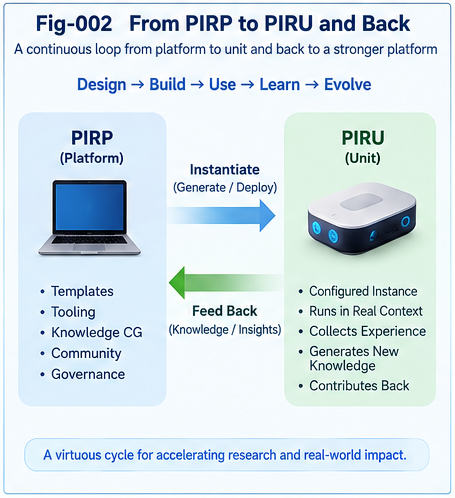
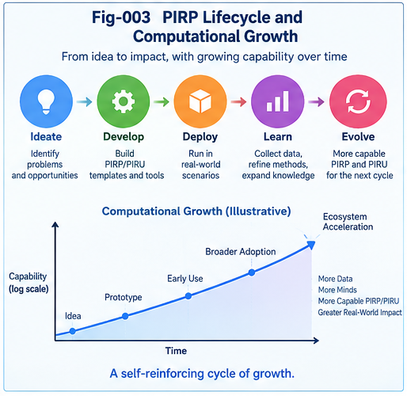
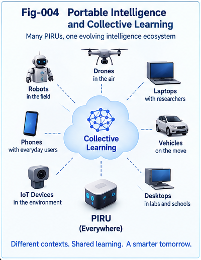
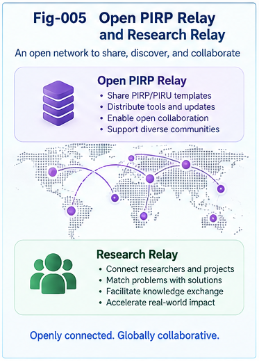
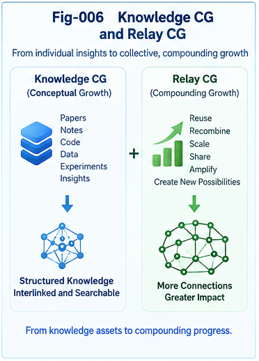
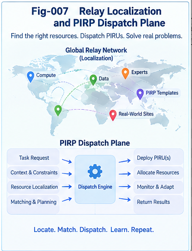

# PIRP / PIRU — Portable Intelligence for a Growing World

## Portable Intelligence Runtime Pieces and Units

### From Per-Node Intelligence to an Open, Relayable, and Computationally Growing Intelligence Ecology

> **The future unit of Collective Intelligence may not be the model alone.**
>
> It may increasingly be the portable intelligence structure that humans, AIs, tools, algorithms, runtimes, and organizations can exchange, localize, continue, compose, and grow together.

---

## Overview

Modern computing provides many powerful abstractions:

- State
- Function
- Class
- Service
- Agent
- CallingGraph
- CallingPath
- CCC
- DNA
- Policy
- Memory

Each captures an important perspective.

But increasingly structural, localized, compositional, and growth-capable intelligence exposes another question:

> **What is the bounded piece of intelligence that actually exists, acts, travels, and grows at runtime?**

This repository introduces two complementary concepts:

### PIRP — Portable Intelligence Runtime Piece

A **PIRP** is a recognizable piece of intelligence that preserves enough structure, context, behavior, state, evidence, interfaces, and growth potential to be carried, published, localized, continued, composed, or evolved.

PIRP is intentionally **discovery-first**.

It allows intelligence to exist before we force it into a fully predefined computational category.

### PIRU — Portable Intelligence Runtime Unit

A **PIRU** is a more formalized runtime intelligence unit with sufficiently explicit:

- identity,
- boundary,
- interface,
- typing,
- execution semantics,
- validation,
- policy,
- and lifecycle.

PIRU is **engineering-first**.

It turns sufficiently understood intelligence into something more reusable, executable, governable, and composable.

Together:

```text
PIRP
 |
 | discovery / recognition / validation
 | boundary finding / typing / interface extraction
 v
PIRU
 |
 | localization / execution / reuse / composition
 v
Runtime
 |
 | observation / structural delta / growth
 v
New PIRP(s)
````

The two are not competing definitions.

They form a duality:

> **PIRP preserves intelligence before complete classification.
> PIRU formalizes intelligence for disciplined computational use.**

---

# 1. Why PIRP / PIRU?

A recurring problem appears as Structural Intelligence moves from static representation toward runtime intelligence.

A node may produce:

```text
1. Value / State
      |
      | What is true now?
      v

2. Structural Trigger
      |
      | What should happen next?
      v

3. Portable Runtime Intelligence
      |
      | What bounded intelligence now exists here?
      v
```

The third output may contain some combination of:

```text
Structure
+
State
+
Computation
+
Trigger
+
Memory
+
Policy
+
Evidence
+
Interface
+
Growth Hooks
```

Traditional categories describe parts of this object.

PIRP/PIRU attempts to describe the runtime intelligence object itself.

---

# 2. A First-Principles View

One of the central hypotheses of this repository is:

> **Intelligence may exist before its computational classification.**

Natural and biological intelligence existed before humans invented categories such as:

```text
Function
Class
State
Graph
Rule
Agent
```

These abstractions are extremely useful.

But they are perspectives and engineering tools rather than necessarily the ontology of intelligence itself.

This motivates the **Pre-Categorical Intelligence Hypothesis**:

> **Intelligence may exist as actionable, adaptive, composable, and growing structure before it is classified into human-designed computational categories.**

Therefore:

```text
Runtime Reality
      |
      v
Emergent Intelligence
      |
      v
PIRP
      |
      v
Formalization
      |
      v
PIRU
```

A useful engineering principle follows:

> **Preserve the runtime piece first; understand and unitize it second.**

---

# 3. PIRP / PIRU Grand Map


The complete framework connects:

```text
Reality / Runtime
       |
       v
Emergent Intelligence
       |
       v
      PIRP
       |
       +----------> Publish
       |
       +----------> Formalize -> PIRU
       |
       +----------> Execute
                        |
                        v
                 Structural Delta
                        |
                        v
                  New PIRP(s)
```

Publishing extends this beyond one runtime:

```text
PIRP
 |
 v
Publish
 |
 v
Public Intelligence Space
 |
 v
Search
 |
 v
Localization
 |
 v
Relay
 |
 v
Receiving Intelligence
 |
 v
Continue Computation
 |
 v
Structural Growth
```

The resulting history forms a **Collective Intelligence CallingGraph**.

---

# 4. PIRP and PIRU

## PIRP

PIRP emphasizes:

* emergence,
* discovery,
* openness,
* heterogeneous structure,
* incomplete boundaries,
* growth,
* preservation of novelty.

## PIRU

PIRU emphasizes:

* formalization,
* identity,
* boundary,
* interface,
* validation,
* controlled execution,
* reuse,
* governance.

A simplified comparison:

| Dimension   | PIRP              | PIRU        |
| ----------- | ----------------- | ----------- |
| Orientation | Discovery         | Engineering |
| Boundary    | Emerging          | Explicit    |
| Structure   | Heterogeneous     | Normalized  |
| Typing      | May be incomplete | Defined     |
| Identity    | Emerging          | Declared    |
| Interface   | May be implicit   | Explicit    |
| Validation  | Exploratory       | Systematic  |
| Growth      | Open              | Controlled  |
| Reuse       | Opportunistic     | Engineered  |
| Governance  | Emerging          | Explicit    |

The system should preserve both.

---

# 5. From PIRP to PIRU — and Back



The lifecycle is not:

```text
PIRP -> PIRU -> Finished
```

Instead:

```text
PIRP
 |
 v
Observe
 |
 v
Recognize
 |
 v
Find Boundary
 |
 v
Validate
 |
 v
Type
 |
 v
Extract Interface
 |
 v
PIRU
 |
 v
Execute / Localize / Compose
 |
 v
Runtime Interaction
 |
 v
Unexpected Structure / Structural Delta
 |
 v
New PIRP
```

Formalization is therefore provisional.

Runtime can reopen intelligence.

---

# 6. PIRP Anatomy

A canonical PIRP may contain:

```text
+---------------------------------------+
|                 PIRP                  |
|---------------------------------------|
| Identity                              |
| Context                               |
| State                                 |
| Structural Knowledge                  |
| Computation / Behavior                |
| Trigger Semantics                     |
| Local Memory                          |
| Policy / Constraints                  |
| Evidence / Confidence                 |
| Interfaces                            |
| Lineage / Provenance                  |
| Growth Hooks                          |
+---------------------------------------+
```

Important properties include:

1. **Identifiable**
2. **Operationally Actionable**
3. **Portable**
4. **Composable**
5. **Observable**
6. **Evolvable**

Not every PIRP must contain every component.

PIRP describes a role in an intelligence ecology, not a fixed software class.

---

# 7. PIRP Lifecycle and Computational Growth



A general lifecycle is:

```text
Birth
  |
  v
Capture
  |
  v
Localization
  |
  v
Execution / Continuation
  |
  v
Observation
  |
  v
Validation
  |
  v
Specialization
  |
  v
Branching / Composition
  |
  v
Unitization
  |
  v
Reuse
  |
  v
Growth
  |
  v
Retirement / Reopening
```

Computational Growth does not mean merely accumulating more objects.

It includes growth of:

* structure,
* capability,
* relations,
* evidence,
* interfaces,
* specialization,
* composition,
* localization,
* and the intelligence type system itself.

---

# 8. Portable Across Intelligences

Software portability usually asks:

> Can this execute on another machine or runtime?

Portable Intelligence asks a larger question:

> **Can another intelligence receive this piece, localize it into its own Known-Knowledge, continue its computation, and grow from where the previous intelligence stopped?**

This produces four useful levels of portability:

```text
Computational Portability
          |
          v
Contextual Portability
          |
          v
Agent Portability
          |
          v
Civilizational Portability
```

A PIRP may move across:

```text
Machine -> Machine
Runtime -> Runtime
Context -> Context
Human   -> Human
Human   -> AI
AI      -> Human
AI      -> AI
Generation -> Generation
```

Therefore:

> **A PIRP is not merely portable across runtimes; it may be portable across intelligences.**

---

# 9. Publishing as Intelligence Transfer



Publishing is one of the first major operations of Portable Intelligence.

```text
Local Intelligence
        |
        v
Externalization
        |
        v
       PIRP
        |
        v
      Publish
        |
        v
Public Intelligence Space
        |
        v
     Discover
        |
        v
     Localize
        |
        v
Receiving Intelligence
        |
        v
Known-Knowledge Update
```

From this perspective:

> **Publish is not merely an information-distribution operation. It is an intelligence-transfer operation.**

A publication becomes especially portable when another intelligence can efficiently reconstruct:

* the problem,
* context,
* assumptions,
* structure,
* evidence,
* counter-evidence,
* failures,
* interfaces,
* and open ends.

This reduces **Continuation Cost**.

---

# 10. PIRP Size Is Not Fixed

A PIRP can exist at many scales:

```text
Trigger
Rule
CCC
Algorithm
CallingPath Fragment
Experiment
Question
Paper
DOI Repository
Composite Knowledge System
```

The important criterion is not physical size.

It is whether the intelligence has enough bounded identity to participate in:

```text
transfer
localization
continuation
validation
composition
growth
```

Thus:

> **Piece means bounded intelligence identity, not necessarily smallness.**

A DOI repository can itself function as a macro-PIRP.

---

# 11. Open PIRP

A central conclusion of this work is:

> **Unresolved does not mean unintelligent.**

A well-formed problem may already contain substantial intelligence.

We define an **Open PIRP** as an unresolved but sufficiently structured intelligence object that exposes a frontier for continued computation.

A canonical Open PIRP may contain:

```text
Problem
Context

Known
Unknown
Known-Unknown Boundary

Structural Gap

Evidence
Counter-Evidence

Constraints
Failed Attempts

Candidate Directions

Required Capabilities
Required Tools

Validation Conditions
Open Interfaces
```

The central proposition is:

> **A well-formed problem is executable intelligence whose next computation has not yet been completed.**

---

# 12. Open PIRP, Relay, and Research



An Open PIRP can be published before resolution:

```text
Problem Recognition
       |
       v
Frontier Structuring
       |
       v
Open PIRP
       |
       v
Publish
       |
       v
Relay
       |
       v
Another Intelligence
       |
       v
Structural Delta
```

This allows unresolved intelligence to become a collective resource.

---

# 13. Failed Attempts Are Intelligence

A failed attempt can preserve:

```text
Problem
+
Attempt
+
Context
+
Expected Outcome
+
Observed Failure
+
Evidence
+
Interpretation
```

This becomes a **Failed-Attempt PIRP**.

A validated failure can reduce future search cost.

Therefore:

> **Failure can be positive intelligence when it changes the structure of future computation.**

The same applies to Counter-Evidence PIRPs.

---

# 14. Relay

When one intelligence reaches its limit, computation need not stop.

```text
Agent-A
   |
   v
PIRP-X
   |
   v
Agent-B
   |
   v
Structural Delta
```

This is a **Relay**.

Relay means:

> **computation continues across an intelligence boundary.**

The receiver may be:

```text
Human
AI
Algorithm
Tool
Database
Simulator
PIRU
Team
Organization
Hybrid System
```

---

# 15. Relay Context

A relay itself contains intelligence.

A preliminary Relay Context includes:

```text
Source PIRP
Source Intelligence
Receiving Intelligence

Context
Reason for Pickup
Perspective

Capabilities Used
Tools Used

Transformation
Evidence Added
Counter-Evidence Added

Structural Delta
Outcome

Derived PIRPs
```

This is richer than ordinary provenance.

### Provenance asks:

> Where did this come from?

### Relay Context asks:

> Why did this intelligence become productive here, and what happened next?

---

# 16. Knowledge CallingGraph and Relay CallingGraph



Two graphs emerge.

## Knowledge CallingGraph

Answers:

> **What intelligence structurally relates to what intelligence?**

Possible relations include:

```text
extends
depends-on
contradicts
validates
specializes
generalizes
implements
composes-with
resolves
opens-question
```

## Relay CallingGraph

Answers:

> **How did intelligence actually move, under what context and perspective, and what Structural Delta resulted?**

Together:

```text
Knowledge CallingGraph
          +
Relay CallingGraph
          +
Context
          +
Agent Capability
          +
Outcome
          |
          v
Collective Intelligence CallingGraph
```

---

# 17. Edge Intelligence

A Relay edge may contain:

```text
Source
Receiver
Context
Perspective
Capability
Transformation
Outcome
```

Therefore the edge itself may become a PIRP.

This leads to a recursive possibility:

```text
Node     = PIRP
Edge     = PIRP
Subgraph = PIRP
Graph    = PIRP
```

In other words:

> **PIRPs can describe relations among PIRPs.**

This supports higher-order structural intelligence.

---

# 18. Structural Comparative Advantage

Relay history may reveal that:

```text
PIRP Type X
+
Context C
+
Perspective P
+
Capability K
        |
        v
Agent-A
        |
        v
Useful Structural Delta
```

This suggests **Structural Comparative Advantage**.

Qualification is not necessarily a permanent label attached to an agent.

It is relational and contextual.

The question becomes:

> **Who or what tends to extend which PIRP, under which context, through which perspective?**

---

# 19. Two Forms of Localization

Structural Intelligence already uses Localization.

PIRP/PIRU extends it.

## Structural Localization

> **Where is the relevant intelligence?**

Targets may include:

```text
CCC
PIRU
CallingPath
Evidence
Policy
Pattern Leaf
```

## Relay Localization

> **Who or what should continue this intelligence?**

Targets may include:

```text
Human
AI
Algorithm
Tool
Team
PIRU
Hybrid Configuration
```

Together they form a broader problem:

> **Computational Growth Localization**

---

# 20. Social Proximity Is Not Intelligence Proximity

Human collaboration often begins with:

```text
Who do I know?
```

Relay Localization instead asks:

```text
Who or what is structurally qualified
to continue this PIRP?
```

The best receiver may be:

> **organizationally distant but structurally near intelligence.**

This motivates Capability Graphs and structural matching beyond conventional social networks.

---

# 21. Three Distances

Relay Localization can consider at least three forms of distance.

### Knowledge Distance

Which existing intelligence is structurally near?

### Capability Distance

Which intelligence is structurally qualified?

### Relay Distance

How difficult is it to transfer the PIRP so that the receiver can actually continue?

Conceptually:

```text
              PIRP
             / | \
            /  |  \
           v   v   v
    Knowledge Capability Relay
     Distance  Distance Distance
            \   |   /
             \  |  /
              v v v
         Relay Candidate
```

---

# 22. PIRP Dispatch Plane



Relay Localization leads naturally to a **PIRP Dispatch Plane**.

```text
                   PIRP
                    |
                    v
          Structural Representation
                    |
                    v
       Structural / Metric Search
                    |
       +------------+------------+
       |            |            |
       v            v            v
   Knowledge     Capability     Tools
    Search         Search       Search
       |            |            |
       +------------+------------+
                    |
                    v
             Candidate Relay
                    |
                    v
          Counter-Evidence Search
                    |
                    v
               PDS / Policy
                    |
                    v
                 Dispatch
                    |
                    v
          Receiving Intelligence
                    |
                    v
             Structural Delta
                    |
                    v
              Relay Context
                    |
                    v
          Collective Intelligence
```

The objective is not merely nearest similarity.

It is:

> **productive continuation.**

---

# 23. Computational Growth Localization

A conceptual joint localization problem is:

```text
Given PIRP P,

find:

Knowledge K
Agent A
Tool T
Context C
Policy G

such that useful Structural Growth
becomes possible.
```

Or:

```text
PIRP
+
Knowledge
+
Agent
+
Tool
+
Context
+
Policy
        |
        v
Expected Structural Growth
```

This is not intended as a fixed mathematical formula.

It identifies the major dimensions of the problem.

---

# 24. PIRP/PIRU Ecology

Once all these mechanisms interact, they form an ecology.

```text
Create PIRP
    |
    v
Publish
    |
    v
Intelligence Commons
    |
    v
Search
    |
    v
Localize
    |
    v
Relay
    |
    v
Continue
    |
    v
Structural Delta
    |
    v
New PIRP / PIRU
    |
    v
Relay CallingGraph
    |
    v
Collective Learning
    |
    v
Better Future Search / Relay / Growth
```

This ecology can contain:

* Solved PIRPs
* Candidate PIRPs
* Open PIRPs
* Counter-Evidence PIRPs
* Failed-Attempt PIRPs
* Validation PIRPs
* Bridge PIRPs
* Composite PIRPs
* Growth PIRPs
* Retired PIRPs

---

# 25. The Ecology Already Partly Exists

A major practical observation is:

> **The PIRP/PIRU ecosystem does not need to be invented from scratch.**

Much of its substrate already exists in:

```text
Papers
GitHub Repositories
Issues
Pull Requests
Questions
RFCs
Benchmarks
Code
Datasets
Experiments
Research Notes
DOIs
Open Problems
```

These already implement parts of:

```text
Produce
  |
  v
Publish
  |
  v
Discover
  |
  v
Pickup
  |
  v
Extend
  |
  v
Validate
  |
  v
Republish
```

The missing transition is primarily to make portable intelligence structures and growth trajectories explicit and machine-operable.

---

# 26. What Is Missing?

The major missing pieces include:

```text
Explicit PIRP Identity

Machine-Operable Context

Known / Unknown Boundary

Structural Relations

Required Capabilities

Relay Context

Growth Lineage

AI Participation
```

This makes an incremental engineering path possible.

---

# 27. AI Does Not Need to Begin as the Strongest Solver

AI can enter the ecology initially as:

```text
PIRP Extractor
Structurer
Indexer
Structural Matcher
Counter-Evidence Finder
Relay Localizer
Relay Assistant
Relay Recorder
```

A particularly important early role is:

> **help the PIRP find the next relay.**

AI therefore does not need to solve every Open PIRP before it becomes useful to the ecology.

---

# 28. The Intelligence Commons

Existing public systems can be viewed as the substrate of an emerging:

> **Intelligence Commons**

The Intelligence Commons does not need to be one centralized database.

It may be a federated layer across:

```text
Repositories
Papers
DOIs
Issues
Benchmarks
Questions
Experiments
```

A PIRP Registry may initially contain only:

```text
PIRP-ID
Title
Type
Source

Problem
Context

Known
Unknown

Evidence
Counter-Evidence

Required Capability

Status

Parent PIRP
Derived PIRPs

Relay History
Validation
Open Ends
```

This alone can support substantial new functionality.

---

# 29. From Knowledge Commons to Growth Commons

Traditional knowledge systems primarily expose:

> What is known?

A PIRP ecology can additionally expose:

```text
What is unknown?

What failed?

What contradicts the current model?

What needs validation?

What can be extended?

What capability is missing?

Where can another intelligence enter?
```

This creates a **Growth Commons**.

Growth opportunities themselves become portable intelligence objects.

---

# 30. One PIRP at a Time

The ecology does not require every participant to understand the complete architecture.

A participant may contribute only:

```text
one counter-example
one experiment
one algorithm
one implementation
one proof
one failed attempt
one structural analogy
```

This leads to one of the central participation principles of the framework:

> **No participant needs to join the whole intelligence system. Each participant only needs to pick up one PIRP.**

The larger ecology integrates these local Structural Deltas.

---

# 31. Collective Learning

Collective Learning can now be represented more concretely:

```text
Create
 |
 v
Publish
 |
 v
Discover
 |
 v
Relay
 |
 v
Transform
 |
 v
Validate
 |
 v
Republish
```

The ecology learns in at least two ways:

```text
Knowledge Growth
      +
Relay Intelligence Growth
```

It learns both:

> **what intelligence exists**

and:

> **how intelligence moves productively.**

---

# 32. Every Relay Teaches the System How to Relay

A relay produces:

```text
PIRP Signature
+
Agent Capability
+
Context
+
Perspective
+
Tool
+
Outcome
+
Structural Delta
```

This becomes training material for future localization.

Therefore:

> **Collective Learning does not only make the Knowledge Graph larger; it makes the system increasingly good at relaying.**

Relay history becomes structural memory.

---

# 33. Open-Ended Growth

A PIRP/PIRU ecology should remain open to:

```text
new PIRPs
new PIRUs
new types
new plugins
new interfaces
new algorithms
new search mechanisms
new validation methods
new policies
new relay patterns
```

Growth may occur:

```text
inside a PIRP
between PIRPs
inside a composite
at a relay edge
inside a capability graph
inside the policy structure
inside the type system
```

Open-Ended Growth is therefore not restricted to one frontier.

---

# 34. Evolutionary Roadmap

The ecology can evolve incrementally.

## Level 0 — Existing Infrastructure

```text
Internet
GitHub
Papers
DOIs
Q&A
Benchmarks
Experiments
```

**State:** Implicit PIRPs.

---

## Level 1 — Explicit PIRP Metadata

```text
Artifact
   |
   v
Explicit PIRP Identity
+
Context
+
Known / Unknown
+
Open Ends
```

**Transition:** Artifact -> explicit intelligence object.

---

## Level 2 — AI PIRP Extraction

```text
Paper / Issue / Repository
          |
          v
      AI Extractor
          |
          v
    Structured PIRP
```

**Transition:** Human-only structuring -> machine-assisted structuring.

---

## Level 3 — AI Relay Localization

```text
PIRP
 |
 v
AI Structural Matching
 |
 +---- Knowledge
 +---- Agent
 +---- Tool
 +---- Perspective
```

**Transition:** Passive publication -> active intelligence routing.

---

## Level 4 — Relay Graph

```text
PIRP
 |
 v
Receiver
 |
 v
Structural Delta
 |
 v
Relay Context
```

**Transition:** Knowledge memory -> growth-history memory.

---

## Level 5 — AI-Generated Open PIRPs

```text
Observation
 |
 v
Gap Detection
 |
 v
Structured Open PIRP
```

**Transition:** AI answers problems -> AI also formulates problems.

---

## Level 6 — PIRP/PIRU Composition

```text
PIRP-A
+
PIRP-B
+
PIRU-C
 |
 v
Composite Intelligence
```

**Transition:** Reuse individual intelligence -> construct higher-order intelligence.

---

## Level 7 — Computational Growth Intelligence

```text
Observe
 |
 v
Detect PIRP
 |
 v
Publish
 |
 v
Search
 |
 v
Localize
 |
 v
Relay
 |
 v
Compose
 |
 v
Validate
 |
 v
Grow
 |
 v
Fold
 |
 v
New PIRP
 |
 +-------------------->
```

**Transition:** AI using knowledge -> AI participating in knowledge-growth infrastructure.

---

# 35. Evolution Ladder

```text
Level 0
Existing Internet / GitHub / Papers / Q&A
Implicit PIRPs
        |
        v
Level 1
Explicit PIRP Metadata
        |
        v
Level 2
AI PIRP Extraction
        |
        v
Level 3
AI Relay Localization
        |
        v
Level 4
Relay Graph
        |
        v
Level 5
AI-Generated Open PIRPs
        |
        v
Level 6
PIRP/PIRU Composition
        |
        v
Level 7
Computational Growth Intelligence
```

Each level can provide useful value before the next level exists.

---

# 36. The Eight Core Articles

The repository develops the framework through eight main articles.

### 001 — From Per-Node Intelligence to Portable Runtime Intelligence

[`PIRP-PIRU-001-From-Per-Node-Intelligence-to-Portable-Runtime-Intelligence.md`](docs/PIRP-PIRU-001-From-Per-Node-Intelligence-to-Portable-Runtime-Intelligence.md)

Introduces PIRP/PIRU from the third composite output of Per-Node Intelligence and identifies the runtime abstraction gap.

---

### 002 — Pre-Categorical Intelligence and the PIRP/PIRU Duality

[`PIRP-PIRU-002-Pre-Categorical-Intelligence-and-the-PIRP-PIRU-Duality.md`](docs/PIRP-PIRU-002-Pre-Categorical-Intelligence-and-the-PIRP-PIRU-Duality.md)

Develops the first-principles distinction between discovery-oriented PIRP and formalized PIRU.

---

### 003 — PIRP Anatomy, Lifecycle, and Computational Growth

[`PIRP-PIRU-003-PIRP-Anatomy-Lifecycle-and-Computational-Growth.md`](docs/PIRP-PIRU-003-PIRP-Anatomy-Lifecycle-and-Computational-Growth.md)

Defines internal structure, lifecycle, minimum properties, growth mechanisms, and governance.

---

### 004 — Publishing as Portable Intelligence Transfer

[`PIRP-PIRU-004-Publishing-as-Portable-Intelligence-Transfer.md`](docs/PIRP-PIRU-004-Publishing-as-Portable-Intelligence-Transfer.md)

Extends portability across intelligences and treats publication as a structural intelligence-transfer operation.

---

### 005 — Open PIRPs and Unresolved Intelligence

[`PIRP-PIRU-005-Open-PIRPs-and-Unresolved-Intelligence.md`](docs/PIRP-PIRU-005-Open-PIRPs-and-Unresolved-Intelligence.md)

Treats well-formed problems, failed attempts, counter-evidence, and Known-Unknown boundaries as first-class intelligence.

---

### 006 — Relay Context and the Collective Intelligence CallingGraph

[`PIRP-PIRU-006-Relay-Context-and-the-Collective-Intelligence-CallingGraph.md`](docs/PIRP-PIRU-006-Relay-Context-and-the-Collective-Intelligence-CallingGraph.md)

Introduces Relay Context, Knowledge CallingGraph, Relay CallingGraph, and Structural Comparative Advantage.

---

### 007 — Relay Localization and Computational Growth Dispatch

[`PIRP-PIRU-007-Relay-Localization-and-Computational-Growth-Dispatch.md`](docs/PIRP-PIRU-007-Relay-Localization-and-Computational-Growth-Dispatch.md)

Extends localization from finding existing intelligence to finding where intelligence can continue growing.

---

### 008 — The PIRP/PIRU Ecology and an Evolutionary Roadmap

[`PIRP-PIRU-008-The-PIRP-PIRU-Ecology-and-an-Evolutionary-Roadmap.md`](docs/PIRP-PIRU-008-The-PIRP-PIRU-Ecology-and-an-Evolutionary-Roadmap.md)

Integrates the framework into a distributed intelligence ecology and proposes the Level 0–7 evolutionary roadmap.

---

# 37. Figures

The repository contains seven canonical figures.

### Fig-001 — PIRP/PIRU Grand Map

[`Fig-001-PIRP-PIRU-Grand-Map.png`](figures/Fig-001-PIRP-PIRU-Grand-Map.png)

Unified view of the PIRP/PIRU ecosystem.

### Fig-002 — From PIRP to PIRU and Back

[`Fig-002-From-PIRP-to-PIRU-and-Back.png`](figures/Fig-002-From-PIRP-to-PIRU-and-Back.png)

Shows Emergence -> Unitization -> Runtime -> Growth -> Emergence.

### Fig-003 — PIRP Lifecycle and Computational Growth

[`Fig-003-PIRP-Lifecycle-and-Computational-Growth.png`](figures/Fig-003-PIRP-Lifecycle-and-Computational-Growth.png)

Shows the runtime lifecycle and structural-growth process.

### Fig-004 — Portable Intelligence and Collective Learning

[`Fig-004-Portable-Intelligence-and-Collective-Learning.png`](figures/Fig-004-Portable-Intelligence-and-Collective-Learning.png)

Shows intelligence moving across heterogeneous participants.

### Fig-005 — Open PIRP Relay and Research Relay

[`Fig-005-Open-PIRP-Relay-and-Research-Relay.png`](figures/Fig-005-Open-PIRP-Relay-and-Research-Relay.png)

Shows unresolved intelligence becoming a relayable research frontier.

### Fig-006 — Knowledge CG and Relay CG

[`Fig-006-Knowledge-CG-and-Relay-CG.png`](figures/Fig-006-Knowledge-CG-and-Relay-CG.png)

Distinguishes knowledge structure from the history of intelligence transfer and growth.

### Fig-007 — Relay Localization and PIRP Dispatch Plane

[`Fig-007-Relay-Localization-and-PIRP-Dispatch-Plane.png`](figures/Fig-007-Relay-Localization-and-PIRP-Dispatch-Plane.png)

Shows structural search, capability localization, policy, dispatch, relay, and feedback.

See:

[`FIGURE-INDEX.md`](FIGURE-INDEX.md)

---

# 38. Repository Structure

```text
Portable-Intelligence-Runtime-Pieces-and-Units/
│
├── README.md
├── START-HERE.md
├── CONTENTS.md
│
├── docs/
│   ├── PIRP-PIRU-001-From-Per-Node-Intelligence-to-Portable-Runtime-Intelligence.md
│   ├── PIRP-PIRU-002-Pre-Categorical-Intelligence-and-the-PIRP-PIRU-Duality.md
│   ├── PIRP-PIRU-003-PIRP-Anatomy-Lifecycle-and-Computational-Growth.md
│   ├── PIRP-PIRU-004-Publishing-as-Portable-Intelligence-Transfer.md
│   ├── PIRP-PIRU-005-Open-PIRPs-and-Unresolved-Intelligence.md
│   ├── PIRP-PIRU-006-Relay-Context-and-the-Collective-Intelligence-CallingGraph.md
│   ├── PIRP-PIRU-007-Relay-Localization-and-Computational-Growth-Dispatch.md
│   └── PIRP-PIRU-008-The-PIRP-PIRU-Ecology-and-an-Evolutionary-Roadmap.md
│
├── figures/
│   ├── Fig-001-PIRP-PIRU-Grand-Map.png
│   ├── Fig-002-From-PIRP-to-PIRU-and-Back.png
│   ├── Fig-003-PIRP-Lifecycle-and-Computational-Growth.png
│   ├── Fig-004-Portable-Intelligence-and-Collective-Learning.png
│   ├── Fig-005-Open-PIRP-Relay-and-Research-Relay.png
│   ├── Fig-006-Knowledge-CG-and-Relay-CG.png
│   └── Fig-007-Relay-Localization-and-PIRP-Dispatch-Plane.png
│
├── GLOSSARY.md
├── FIGURE-INDEX.md
├── FUTURE-DIRECTIONS.md
├── CHANGELOG.md
├── CITATION.cff
├── .zenodo.json
└── GitHub-Release-Notes-v1.0.0.md
```

---

# 39. Suggested Reading Path

For a first reading:

```text
README
   |
   v
PIRP-PIRU-001
   |
   v
PIRP-PIRU-002
   |
   v
PIRP-PIRU-003
```

This establishes the object.

Then:

```text
004 -> Publish
005 -> Open PIRP
006 -> Relay Context
007 -> Relay Localization
008 -> Ecology
```

For a shorter path:

```text
README
  |
  v
001
  |
  v
005
  |
  v
007
  |
  v
008
```

---

# 40. What This Repository Does Not Assume

This repository does **not** require that:

* every intelligence object must become a PIRU,
* every PIRP must be small,
* every PIRP must be executable machine code,
* every problem must have a known solution,
* one model must contain all intelligence,
* one organization must control the ecology,
* AI must autonomously solve every problem,
* today's PIRP categories are final.

The framework is intentionally open to structural growth.

---

# 41. What PIRP/PIRU Is Not

PIRP/PIRU should not be reduced to:

```text
another software component model
another agent framework
another object system
another message format
another knowledge graph
another workflow engine
```

It can interact with all of these.

But its first concern is more general:

> **What portable piece of intelligence exists here, and how can it continue to act and grow?**

---

# 42. Research Hypothesis

The repository proposes the following broad hypothesis:

> **As AI becomes increasingly structural, localized, compositional, distributed, and growth-capable, intelligence itself may need to become a first-class portable runtime object.**

This object may be:

* discovered before complete formalization,
* formalized when sufficiently understood,
* published across intelligence boundaries,
* localized into new contexts,
* relayed to new intelligences,
* composed with other intelligence,
* validated and challenged,
* and reopened when runtime growth produces novelty.

---

# 43. From Model Ecology to Intelligence Ecology

A model-centric view asks:

```text
Which model knows the answer?
```

An intelligence-ecology view can ask:

```text
Which PIRP contains relevant intelligence?

Which PIRU can execute here?

Which evidence challenges it?

Which intelligence can continue it?

What can compose with it?

Where can it grow next?
```

Models remain extremely important.

But they become participants in a larger intelligence runtime.

---

# 44. The Larger Vision

The long-term vision is not necessarily:

```text
One Giant Shared Brain
```

It may instead be:

```text
Many Humans
+
Many AIs
+
Many Tools
+
Many PIRUs
+
Portable Intelligence
+
Structural Localization
+
Relay
+
Collective Learning
+
Computational Growth
```

Each participant can remain locally specialized.

Portable Intelligence connects them.

---

# 45. Canonical Principles

The framework can be summarized by the following principles:

1. **Intelligence precedes its computational classification.**
2. **Preserve emerging intelligence before forcing complete formalization.**
3. **PIRP and PIRU are complementary, not competing abstractions.**
4. **Portability extends beyond machines to contexts and intelligences.**
5. **Publishing can be an intelligence-transfer operation.**
6. **A well-formed unresolved problem can itself be intelligence.**
7. **Failed attempts and counter-evidence should remain reusable.**
8. **Relay Context is itself intelligence.**
9. **Knowledge structure and intelligence-growth history should both be preserved.**
10. **Social proximity is not intelligence proximity.**
11. **Localization can search for where intelligence should continue, not only where an answer already exists.**
12. **Capability and permission must remain distinct.**
13. **Every relay can teach the system how to relay better.**
14. **Collective Learning includes both Knowledge Growth and Relay Intelligence Growth.**
15. **Open Ends and Leftovers are potential growth interfaces.**
16. **No participant needs to join the whole intelligence system; one PIRP is enough.**

---

# 46. Final Perspective

The complete transition proposed by this repository is:

```text
Static Computation
        |
        v
Runtime Intelligence
        |
        v
Portable Intelligence
        |
        v
Published Intelligence
        |
        v
Relayable Intelligence
        |
        v
Composable Intelligence
        |
        v
Collective Learning
        |
        v
Computational Growth Intelligence
```

The underlying infrastructure does not need to appear all at once.

The transition can begin with systems that already exist.

What changes first is our ability to recognize their intelligence structure.

A paper may become more than a document.

A question may become more than a request for an answer.

A failed experiment may become more than discarded work.

A repository may become more than a collection of files.

A relay may become more than a social interaction.

Each can become part of an explicit, searchable, relayable, and growing intelligence structure.

The central idea is therefore simple:

> **Intelligence can be bounded, carried, published, received, localized, continued, composed, and grown.**

And the ecological principle is even simpler:

> **No participant needs to join the whole intelligence system. Each participant only needs to pick up one PIRP.**

From enough such local continuations, a larger structure can emerge:

> **a distributed runtime for the continued growth of intelligence itself.**

---

## Repository Navigation

* [`START-HERE.md`](START-HERE.md) — Fast introduction
* [`CONTENTS.md`](CONTENTS.md) — Complete content map
* [`FIGURE-INDEX.md`](FIGURE-INDEX.md) — Figure navigation
* [`GLOSSARY.md`](GLOSSARY.md) — Core terminology
* [`FUTURE-DIRECTIONS.md`](FUTURE-DIRECTIONS.md) — Research and engineering directions

---

## Status

**Research Stage:** Conceptual Framework / Early Structural Architecture

**Current Focus:**

```text
PIRP / PIRU
Portable Intelligence
Open PIRP
Relay Context
Relay Localization
Collective Intelligence CallingGraph
Computational Growth
```

The framework is intentionally open-ended and expected to evolve through further research, implementation, validation, counter-evidence, and collective contribution.

